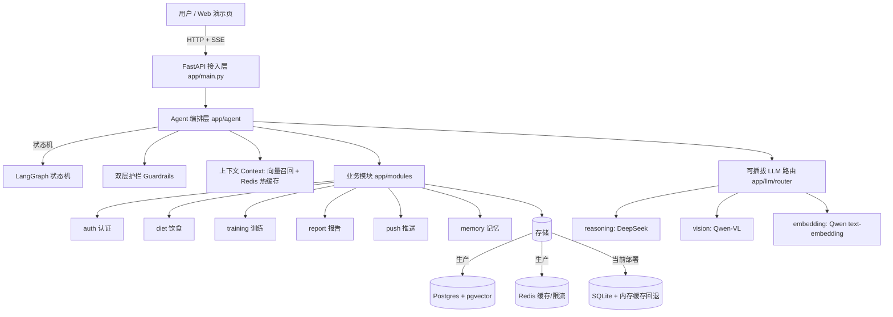

# 健身 AI Agent

> 一个**部署在公网、可被真实用户使用**的 AI 健身教练。不是 Demo——它跑着真实的大模型，能看你的饮食 / 训练截图、跟你对话、给你可执行的建议。

---

## 📖 项目简介

**痛点**：私教太贵，免费 App 记三天就弃；市面上的"AI 教练"大多只是表单 + 模板文案，既没有真实的大模型理解，也不会主动陪伴。

**目标**：做一个**主动干预 + 用户确认**的 AI 健身教练——它帮你记录饮食 / 训练，从对话里理解你的状态，主动给建议，但任何写入数据的动作都先让你确认。

**当前形态**：
- 后端：FastAPI + 真实大模型（推理 DeepSeek、视觉 / 向量 Qwen），已部署腾讯云 CloudBase 公网可访问。
- 前端：原生 HTML/JS 演示页，`static/index.html` 默认首页即 **AI 教练对话页**（`/privacy` 为隐私页）。
- 定位：个人级工程项目，未来可走"对公众收费"路线（定价锚定 ¥9.9–29.9/月，远低于私教）。

---

## ✨ 核心特性

- **💬 对话式 AI 教练**：SSE 流式回复，自然语言记录 / 查询 / 建议。
- **📷 图文识别**：发一张 Keep 等训练截图或饮食照片 → 视觉模型结构化识别 → **用户确认后才入库**。
- **🧠 长期画像记忆**：每轮对话自动抽取用户画像 / 反思 / 洞察写入向量库，下次聊天定向召回，实现个性化教练。
- **🛡 合规护栏（双层）**：关键词黑名单 + LLM 语义复核，拦截越界医疗措辞，每条回复强制附免责声明。
- **🔔 主动推送**：基于事件触发的提醒（≤ 3 条 / 天，Redis 限流），避免打扰。
- **🔌 可插拔 LLM**：`reasoning`(文本) / `vision`(视觉) / `embedding`(向量) 各自可接不同供应商，换模型只改 `.env`。

---

## 🏗 技术架构



**分层**：接入层（FastAPI 路由）→ Agent 编排层（LangGraph 状态机 + 护栏 + 上下文）→ 业务模块（垂直切片）→ 基础设施（LLM 路由 / 存储 / 缓存）。模块间不直接 import 业务代码，经 skill 注册表暴露能力。

---

## 🛠 技术栈

| 维度 | 选型 |
|------|------|
| 语言 / 框架 | Python 3.13 · FastAPI · SQLAlchemy(async) |
| 大模型 | 推理 DeepSeek-V3 · 视觉 Qwen-VL · 向量 Qwen text-embedding-v3（均可插拔替换） |
| Agent | LangGraph 状态机 + 自定义护栏 |
| 存储（生产） | PostgreSQL + pgvector（向量）+ Redis（缓存 / 限流） |
| 存储（当前部署） | SQLite + 内存缓存回退（零成本，业务代码无感切换） |
| 部署 | Docker 容器 · 腾讯云 CloudBase 云托管（云端构建发布） |
| 前端 | 原生 HTML / JS 演示页，由后端 `FileResponse` 托管 |
| 测试 | pytest，零网络 / 零 key / 零基础设施即可全绿 |

---

## 📂 目录结构

```
.
├── app/
│   ├── main.py            # FastAPI 入口：挂载路由 + 启动建表 / 建扩展
│   ├── config.py          # 读 .env，按用途拆分 LLM 供应商与数据库连接
│   ├── core/              # db（Postgres/SQLite 自动选）、redis（单例+降级）、security（JWT/密码）、logging
│   ├── llm/               # 可插拔 LLM 层：base 抽象 / registry 装配 / router 业务入口 / providers（fake + OpenAI 兼容）
│   ├── modules/           # auth / diet / training / report / push / memory（各含 domain/service/api）
│   └── agent/             # LangGraph 状态机 + 护栏 + context（语义召回 + Redis 热缓存）
├── static/                # 前端演示页：index.html（AI 教练）/ privacy.html（隐私政策）
├── scripts/               # 部署 / 验证 / 诊断脚本（tcbr_*.py、verify_chat.py 等）
├── tests/                 # 镜像模块的零网络冒烟测试
├── Dockerfile            # 官方 python:3.13-slim 基础镜像
├── docker-compose.yml    # 本地一键起 Postgres(pgvector) + Redis
├── requirements.txt
└── .env.example          # 配置模板（真实 .env 已 gitignore）
```

---

## 🚀 快速开始

### 1. 准备环境

```bash
# 建议 Python 3.13
python -m venv .venv
.venv/Scripts/activate        # Windows；Mac/Linux 用 source .venv/bin/activate
pip install -r requirements.txt
cp .env.example .env          # 填入你的 LLM API Key
```

### 2. 跑测试（核心验收：全绿即通过）

```bash
pytest -q
```

覆盖 auth / llm / diet / training / report / push / memory / agent 能力 / 合规护栏 / 画像记忆 / 训练截图识别等，**全程不联网、不填 key、零基础设施**（自动走 SQLite + 无 Redis 回退）。

### 3. 本地启动看接口

```bash
uvicorn app.main:app --reload --port 8000
# 浏览器打开 http://127.0.0.1:8000/ 即为 AI 教练对话页
# 健康检查：http://127.0.0.1:8000/health
```

或用 curl 走一遍注册 → 登录 → 调接口：

```bash
curl -X POST localhost:8000/auth/register -H 'Content-Type: application/json' \
  -d '{"username":"alice","password":"secret123"}'
curl -X POST localhost:8000/auth/login -H 'Content-Type: application/json' \
  -d '{"username":"alice","password":"secret123"}'
# 用返回的 access_token 调：
curl localhost:8000/auth/me -H 'Authorization: Bearer <access_token>'
```

### 4. 生产部署（Postgres + pgvector + Redis）

```bash
# 一键起本地全套依赖（Postgres 带 pgvector + Redis）
docker compose up -d
# .env 里把 DATABASE_URL 改成 postgresql+asyncpg://...，REDIS_URL 改成 redis://...
# 安装生产依赖：pip install asyncpg pgvector redis
```

`init_db` 会在 Postgres 模式下自动 `CREATE EXTENSION vector` 并建 HNSW 索引，无需手工迁移。云端部署通过 CloudBase 云托管（源码上传 → 云端构建 → 全量发布），详见 `DEPLOY.md`。

---

## 🔑 配置说明

所有密钥与连接串走 `.env`（已 gitignore）。关键变量：

- `LLM_REASONING_*` / `LLM_VISION_*` / `LLM_EMBEDDING_*`：三个用途各自的基础地址、模型名、API Key。
- `DATABASE_URL`：留空或 `sqlite` 走 SQLite 回退；填 `postgresql+asyncpg://...` 走生产栈。
- `REDIS_URL`：留空则自动降级（无 Redis 时缓存 / 限流跳过）。

业务代码**只调用** `app.llm.router` 的 `reason / see / embed`，换模型、换供应商完全不改业务代码。

---

## 🛡 合规与隐私

- **不做医疗诊断**：产品表述避开"诊断 / 医疗 / 体脂 / 康复"等词，走"工具"类目；Agent 仅给建议并附免责声明，不碰医疗判断。
- **数据隔离**：用户数值（饮食 / 训练 / 睡眠 / 推送）只进数据库，绝不进文档/wiki。
- **密钥安全**：`.env`、`cloudbaserc.json`、数据库文件、`.workbuddy/` 均已 gitignore，不进入版本库与公开仓库。
- **确认前置**：任何写入用户数据的动作都先经用户确认，Agent 不静默改写。

---

## 📄 许可证

本项目当前用于作品集展示。具体许可条款待定；如需商用或二次开发，请先联系作者。

---

## ⚠️ 免责声明

本项目提供的所有健身 / 饮食建议**仅供参考，不构成医疗诊断或专业医疗意见**。如有健康问题，请咨询持证专业人士。
